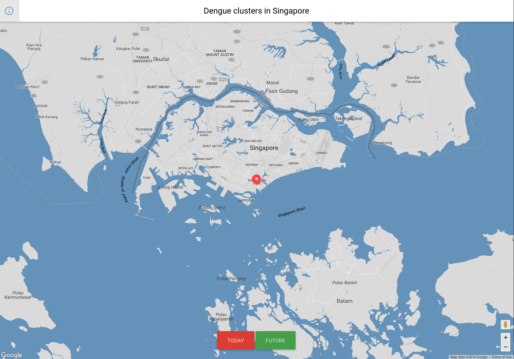

# dengue-clusters

With the help of anonymized clinical records, weather data and Machine Learning a model was created in Microsoft Azure to predict the specific location of future Aedes mosquito breeding habitats. This is the client application that is fully functional to import and show the future dengue clusters in Singapore with help of Google Maps API.

The data we tested with was unfortunately too scarce (~every day for the past two months) to be able to draw any conclusions on how mosquitos are related to weather changes. This is why no data is included in this repository.

### To run
* `npm install`
* `grunt server`

This project was created @ Microsoft Data Science Student Challenge by Michael Novén, Andres Galaviz, Ibbe D Said and James Spicer
